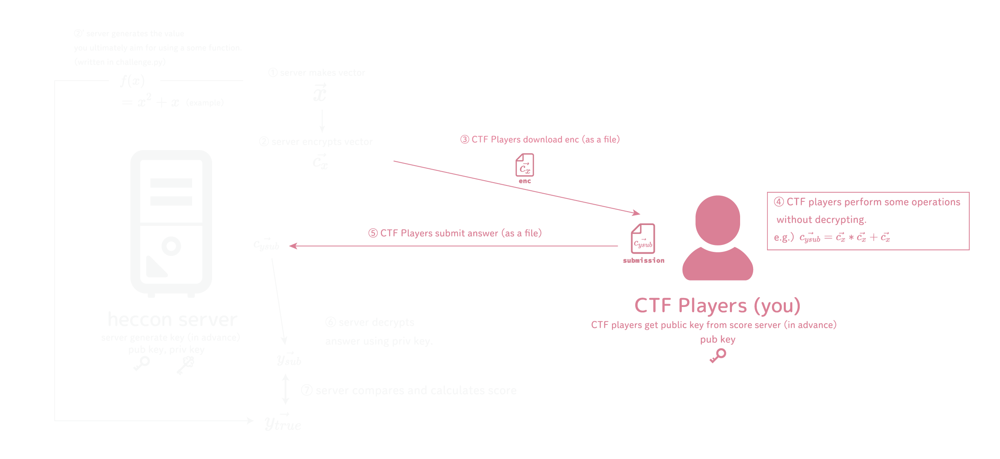

# HECCON

King of the Hill game about leveled Fully Homomorphic Encryption (LFHE), named Homomorphic Encryption Coding CONtest, HECCON.

__Attacking the platform is strictly prohibited.__

## Overview

- LFHE can perform some operations on encrypted data without decryption, such as addition or multiplication.
- In LFHE, there are some restrictions in computation:
  - Available nonlinear operation is only multiplication. For example, even inverse can't be done easily.
  - The number of multiplication is restricted.
- At each stage (see below for the meaning of stages), you are given an encrypted numeric array (numpy's ndarray) and a rule file describing what operation should be done.
- The goal of the game is to perform the operation on the encrypted data as accurately as possible within the restrictions.

## Game Structure and Scoring System

- The game is splitted into 4 stages, each of which has 42 rounds. Each round lasts 5 minutes.
  - So each stage lasts 3 hours and 30 minutes.
- The public/private key pair used is the same for all stages. You can download the public key (and related files) from the SECCON CTF score server.
- Each stage has its own challenge. You can download it from the "Data" page when a new stage starts.
- You can submit your solution on the "Submissions" page. You can only submit your solution once within each round.
- When you submit your encryption, the server calculates the mean absolute error (MAE).
- When the round is finished, the server creates a ranking of the best submissions in ASCENDING order of MAE (rounded to four decimal places), and calculates the score based on this ranking. You can see the ranking and the score on the "Leaderboard" page.

## Score Calculation

The score for SECCON CTF will be added based on the rank in each round as follows:

| Rank | Score |
| :--: | :---: |
| 1    | 20    |
| 2    | 16    |
| 3    | 12    |
| 4    | 9     |
| 5    | 6     |
| 6    | 4     |
| 7    | 2     |
| 8    | 1     |
| 9    | 0     |

## References

- [HELayers API Docs](https://ibm.github.io/helayers/reference/index.html)

## Acknowledgement

This game is inspired by some homomorphic encryption challenges in DiceCTF. I love them and decide to make this competition.
